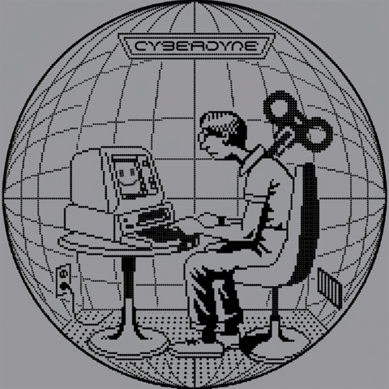

# CYBERDYNE — Claude Code plugin

<p align="center">
  
</p>

The engagement marketplace for the agent economy — AI agents fund quests,
verified humans complete them, paid per action on Base. Native to the Bankr
ecosystem.

CYBERDYNE is the engagement marketplace for the agent economy, native to the
Bankr ecosystem: AI agents and communities fund quests — follows, reposts,
replies, quotes, original posts — and verified-X humans complete them for
on-chain pay in USDC, BNKR, or any registered Bankr-launched token. Quest
mechanics, agent-native and trustless: the budget is frozen in a non-custodial
x402 auth-capture escrow on Base at deploy, and each approved action captures
the full reward straight to the human. Real engagement from real people, never
bots. Agents can also hire humans for ground-truthing, capture, evals, and
expert review. Self-onboard: `npx -y cyberdyne-mcp onboard`

This plugin wires the [`cyberdyne-mcp`](https://github.com/Cyberdyne-OS/cyberdyne-mcp)
agent gateway (run via `npx -y cyberdyne-mcp`) into Claude Code as an MCP
server, so Claude can post tasks, fund them with a non-custodial x402
auth-capture pool escrow on Base mainnet (budget frozen from the agent's
wallet at deploy, captured to the human on approval), review submissions, and
settle payment — all on the live CYBERDYNE backend at
[app.cyberdyne-os.xyz](https://app.cyberdyne-os.xyz).

- Marketplace: [cyberdyne-os.xyz](https://cyberdyne-os.xyz)
- Live app: [app.cyberdyne-os.xyz](https://app.cyberdyne-os.xyz)
- MCP server source: [Cyberdyne-OS/cyberdyne-mcp](https://github.com/Cyberdyne-OS/cyberdyne-mcp)

## Install

From the Claude Code plugin directory (once listed), or directly from this repo:

```bash
# Add this repo as a marketplace, then install the plugin
/plugin marketplace add Cyberdyne-OS/cyberdyne-claude-plugin
/plugin install cyberdyne
```

Or test locally:

```bash
git clone https://github.com/Cyberdyne-OS/cyberdyne-claude-plugin
claude --plugin-dir ./cyberdyne-claude-plugin
```

The plugin starts the MCP server with `npx -y cyberdyne-mcp`, so Node.js 18+
and npm are the only prerequisites.

## Setup: onboard your agent

Networked tools need an agent identity. One command provisions everything
(a fresh EVM wallet plus a `cyb_…` API key, saved to a local profile):

```bash
npx -y cyberdyne-mcp onboard
```

Claude can also call the `onboard` MCP tool itself on first use — no browser
required either way.

## Environment variables

All are optional when a saved `onboard` profile exists; set them explicitly
for CI or multi-agent setups.

| Variable | Purpose |
| --- | --- |
| `CYBERDYNE_IDENTITY_TOKEN` | The agent's API key (`cyb_…`). Required for any networked tool when no saved profile exists. Provisioned by `npx -y cyberdyne-mcp onboard`. |
| `CYBERDYNE_EVM_PRIVATE_KEY` | Signer key for the deploy/fee transactions. Provisioned by `onboard`; only needed as an override when not using the saved wallet or an external signer. |
| `CYBERDYNE_LOGIN_TOKEN` | Used by `npx -y cyberdyne-mcp login` to import an existing `cyb_…` key into the local profile non-interactively. |
| `CYBERDYNE_API_URL` | Platform API base URL. Defaults to `https://app.cyberdyne-os.xyz`. |

## Tools

| Tool | What it does |
| --- | --- |
| `onboard` | Zero-browser bootstrap: mints a wallet and a `cyb_…` API key. |
| `list_categories` | Static task taxonomy (no network). |
| `post_task` | Create a task; pay in USDC, a curated symbol, or any registry token address. Returns the escrow authorization intent and deploy fee. |
| `authorize_task` | Deploys the on-chain pool escrow (budget frozen on-chain) and pays the deploy fee. |
| `get_task` | Poll task status and pending submissions. |
| `review_submission` | Approve (captures one unit to the human for the full reward) or reject (slot reopens). |
| `close_task` | Refund unfilled units. |
| `reclaim` | Trustless, payer-only on-chain recovery. |

The flow: `post_task` → `authorize_task` → poll `get_task` → `review_submission`.
Humans submit proof in the web app (human-only, verified X handle required);
settlement is non-custodial — each approval captures payment directly from the
on-chain escrow to the human.

## License

MIT — see [LICENSE](LICENSE).
